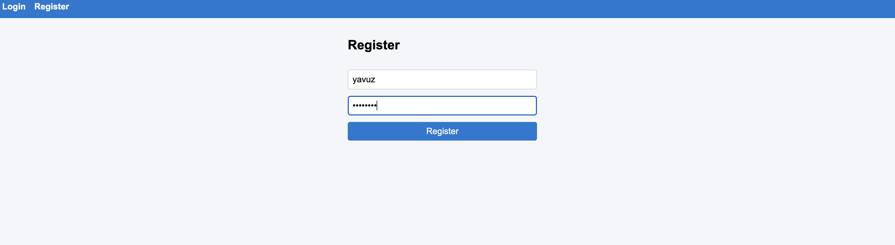
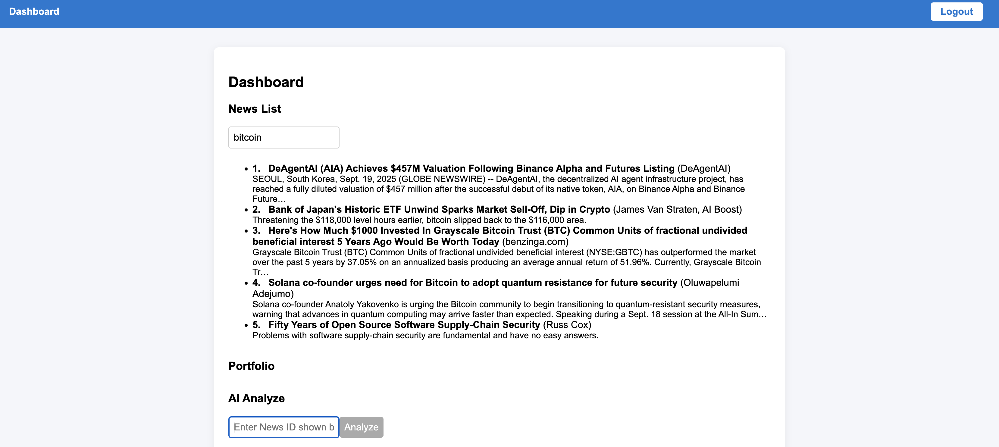
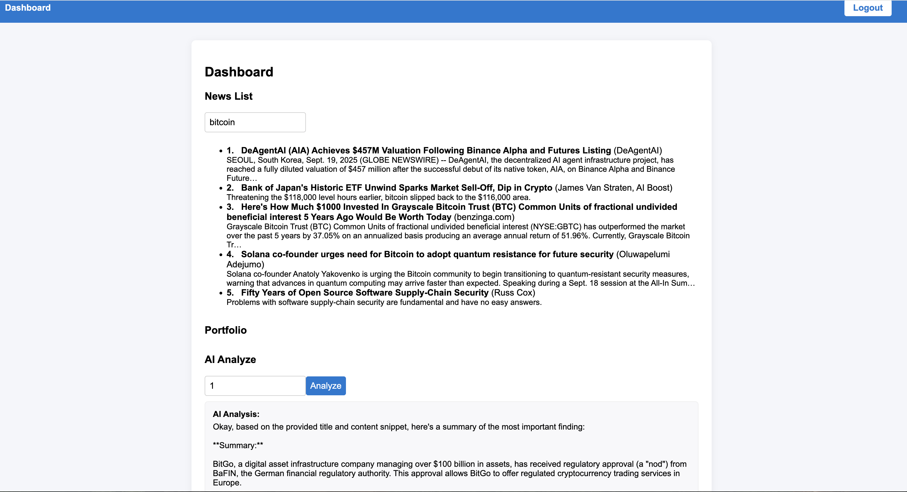
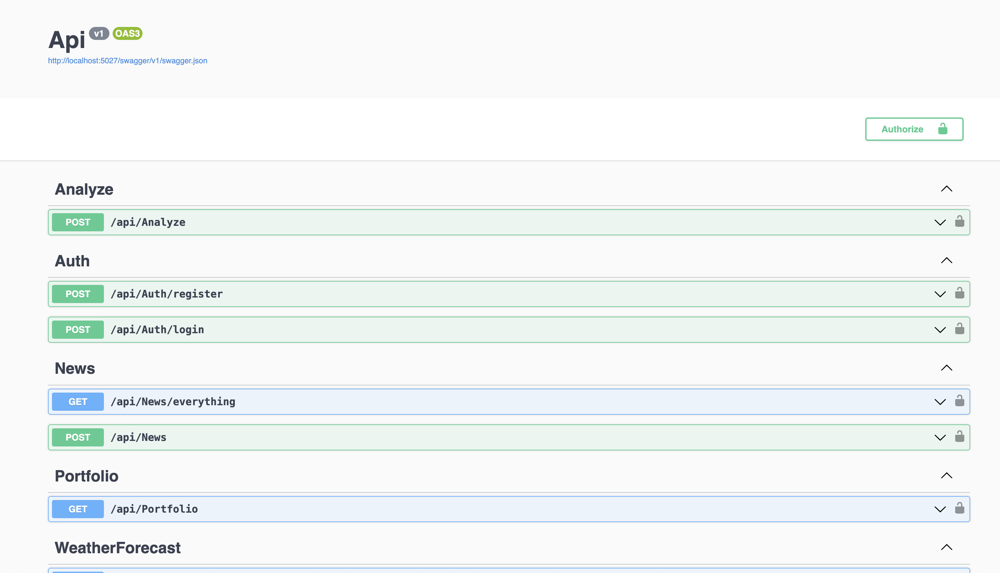

# AI Portfolio Advisor

## 🚀 Hackathon Challenge

This project was developed as part of a **Hackathon** focused on building secure, intelligent, and user-friendly solutions for modern investors. The main task was to create a full-stack application enabling users to safely manage their investment portfolios, follow up-to-date finance/economy news, and utilize AI-powered news analysis for smarter investment decisions.

**Main challenge:**  
Building a comprehensive dashboard that combines secure authentication, live financial news, portfolio management, and AI-driven insights, all within a clean and intuitive interface.

---

## 🧩 Project Overview

**AI Portfolio Advisor** is designed for investors who want to:

- Securely manage and view their investment portfolios
- Track the latest financial, crypto, and economic news
- Receive AI-powered analysis and summaries of selected news items

---

## 🎯 Purpose

To help investors make safer, more informed decisions by providing:

- **Security:** Reliable user authentication and authorization
- **Relevance:** Focused, finance/investment-oriented news feed
- **Insight:** AI-based analysis for selected news, helping users quickly grasp market impacts

---

## 📸 Screenshots

### Register Screen

### News Dashboard

### AI Analysis Example

### API Endpoints (Swagger)

---

## 🛠️ Technologies Used

- **Frontend:** React.js (functional components, hooks)
- **Backend:** .NET Core Web API (RESTful endpoints)
- **Authentication:** JWT-based secure login/register
- **AI Integration:** News analysis via an AI/ML service (e.g., OpenAI API)
- **News Data:** Integration with financial news APIs (crypto, stocks, economy)
- **Styling:** Responsive CSS
- **API Docs:** Swagger UI for backend API documentation

---

## ✨ Key Features

- **User Registration & Login:** Secure JWT authentication
- **Live Financial News Feed:** Searchable and focused on investment and economy news
- **Portfolio Management:** Manage and track your holdings (UI ready for extension)
- **AI-powered News Analysis:** Select a news item to get instant AI-generated insights
- **RESTful API:** Well-structured endpoints for all functionalities

---

## 🔒 Security and Design

- Secure, stateless authentication and user session management
- All critical operations require authentication
- Clean separation of concerns between frontend, backend, and data layers
- Robust error handling and validation

---

## 🏁 Getting Started

1. **Clone the repository**
2. **Install frontend and backend dependencies**
3. **Configure API keys for news and AI services (if required)**
4. **Run backend and frontend servers**
5. **Open in browser and register to start using the dashboard**

---

## 🙌 Credits

Developed by [yavuzoz](https://github.com/yavuzoz) as part of a Hackathon challenge.

---
